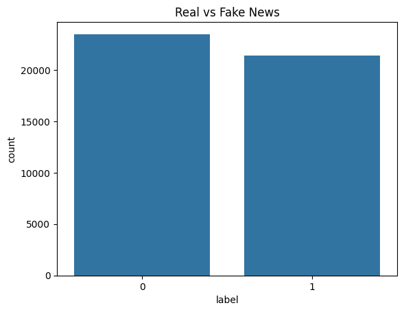
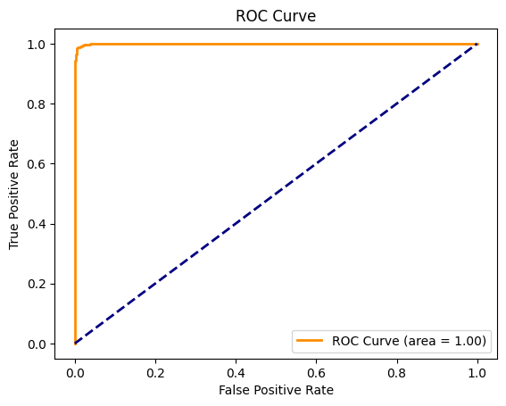
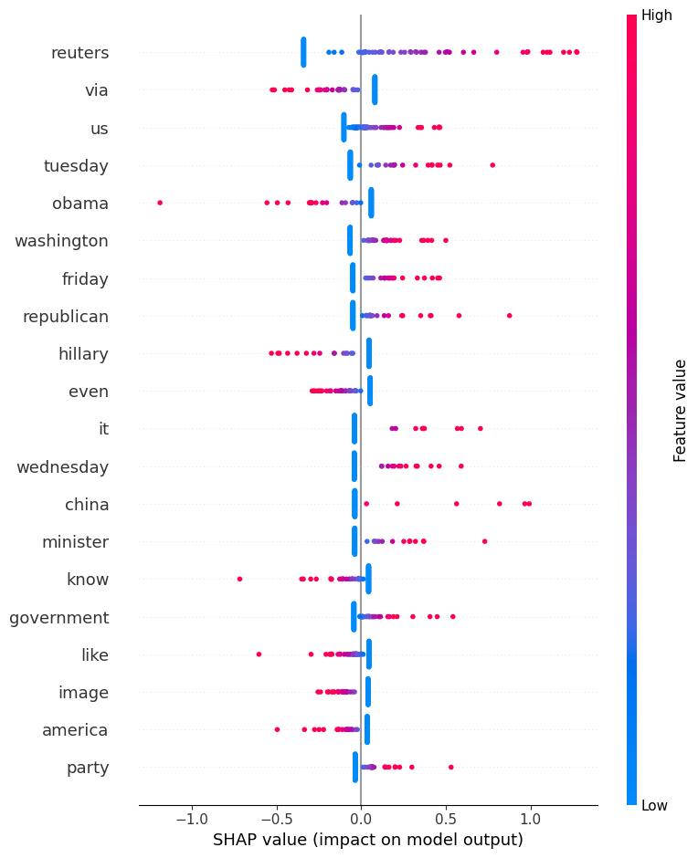

# 📰 Fake News Detection with Machine Learning


This project builds a machine learning model to classify news articles as real or fake using the Fake and Real News Dataset from Kaggle.

## 🚀 Features

- Classifies news as **Fake** or **Real**
- Uses both **Logistic Regression** and **SVM** models
- Visual performance evaluation (ROC Curve, Confusion Matrix)
- Clean text preprocessing (stopwords, lemmatization)
- Real-world dataset from Kaggle

## 📑 Table of Contents
- [Features](#-features)
- [Dataset](#-dataset)
- [Installation](#-installation)
- [Usage](#-usage)
- [Visualizations](#-visualizations)
- [Results](#-results)
- [Future Work](#-future-work)


## 📂 Dataset
- Source: [Kaggle - Fake and Real News](https://www.kaggle.com/datasets/clmentbisaillon/fake-and-real-news-dataset)
- Two CSV files: `Fake.csv` and `True.csv`

## 🧠 ML Workflow
- Text cleaning: lowercasing, punctuation removal, stopword removal
- Feature extraction using TF-IDF
- Model training: Logistic Regression, Naive Bayes, SVM, Random Forest
- Performance evaluation: accuracy, classification report, confusion matrix

## 📈 Results
- Logistic Regression and SVM achieved >90% accuracy
- Confusion matrix and ROC curve visualizations included

## 💼 Future Work

- Deploy the model as a web app using **Streamlit**
- Integrate live news scraping for real-time predictions
- Experiment with deep learning models (e.g., LSTM, BERT)
- Improve model performance with advanced NLP techniques

## 📸 Screenshots

### 🔍 Distribution of Real vs Fake News


### 📊 Confusion Matrix


### 🧠 Model Accuracy Comparison


## 🚀 Future Enhancements
- Deploying the model with Streamlit for real-time predictions
- Using transformer models (like BERT) for deeper understanding
- ## 🚀 Getting Started

1. Clone the repository:
   ```bash
   git clone https://github.com/Valexander600/ml-fake-news-detector-logreg-svm.git
   cd ml-fake-news-detector-logreg-svm
jupyter notebook FakeNewsDetector.ipynb


## 📁 Files
- `FakeNewsDetector.ipynb`: Colab notebook with code, analysis, and results

## 📦 Installation

Install the required packages using pip:

```bash
pip install -r requirements.txt

- ## 📝 License

This project is licensed under the MIT License.

